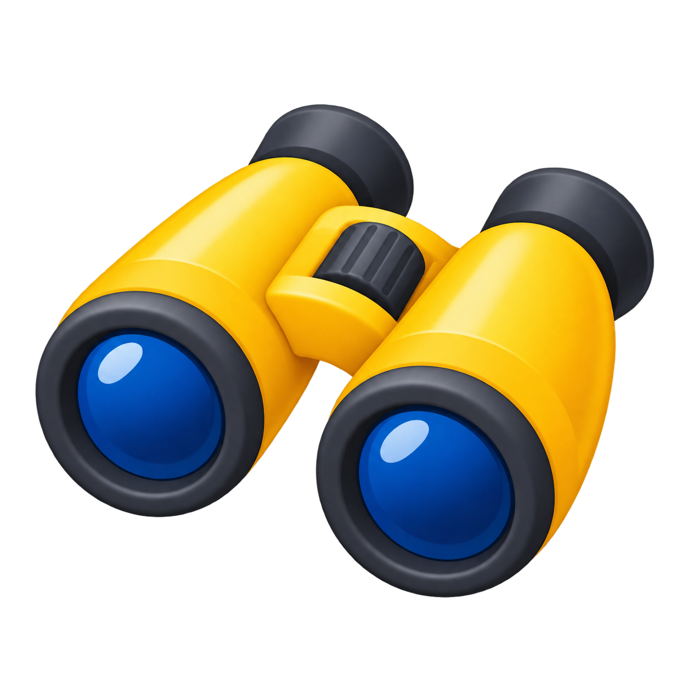

# VisNavKit logo

Generated with the built-in image generation tool on 2026-09-08.

Asset: `visnavkit-logo.png`. The original PNG is preserved with its alpha channel.
This first logo is retained as an earlier design. The project README now uses
option D with the project name beside it as native HTML text.

## Generation prompt

```text
Use case: logo-brand
Asset type: primary mascot icon for VisNavKit, an open-source visual robot navigation toolkit; suitable for a GitHub README, package icon, and avatar.
Primary request: an original, exceptionally simple and memorable friendly mascot with the approachable emoji charm of Hugging Face.
Subject and concept: a sunny golden-yellow navigation map-pin character with a broad softly rounded head and a short, gentle point at the bottom. Its two large curious dark-charcoal camera-lens eyes give it a visual-navigation identity. A tiny curved smile makes it warm and welcoming. The overall silhouette should be compact and instantly recognizable.
Style/medium: professionally designed flat vector-style mascot logo, bold smooth curves, very few shapes, crisp anti-aliased edges, restrained warm orange accents, consistent dark outlines, cheerful open-source community personality. Minimal enough to remain legible at 32 pixels.
Composition: one standalone centered icon, square canvas, generous even transparent margin, icon fills about 78 percent of canvas.
Scene/backdrop: genuinely transparent background with preserved alpha, no opaque white rectangle and no checkerboard pattern.
Constraints: icon only, no letters or text, no wordmark, no watermark, no mockup, no presentation board, no extra symbols, no gradients or 3D rendering, no shadows outside the silhouette, no detailed robot body. Create a distinct original mascot, not a copy of Hugging Face's hugging-hands face.
```

## Emoji alternatives — 2026-09-08

Design direction from user feedback: prefer familiar emoji styling, simple silhouettes,
and modest facial features. Avoid the first version's oversized camera eyes.
These four alternatives were generated separately with the built-in image generation tool.

| A — Binoculars | B — Compass | C — Robot | D — Navigation arrow |
| --- | --- | --- | --- |
|  |  |  |  |

### Exact prompts

Each request used the following shared prompt followed by its subject paragraph below.

```text
Use case: logo-brand
Asset type: a standalone emoji-style logo option for VisNavKit, a visual-navigation open-source project.
Style: authentic modern emoji aesthetic, extremely simple shapes, friendly, chunky rounded proportions, clean readable silhouette, tiny restrained highlights with soft minimal shading. Polished like an emoji in a chat app. A few flat saturated colors. Avoid illustration-level complexity. It must read clearly as a small emoji at 48 pixels.
Backdrop: genuinely transparent background with alpha, no checkerboard, no opaque canvas.
Composition: one centered standalone symbol on a square canvas, about 74 percent canvas occupancy, even breathing room.
Constraints: no letters, text, labels, borders, presentation layouts, watermark, scenery, realistic materials, realistic eyes, huge eyes, concentric camera-eye rings, eyelashes, blush, elaborate robot anatomy, map pins, or photorealism. This should be much simpler than a detailed mascot drawing.
```

#### A — Binoculars

```text
Subject: a classic pair of compact golden-yellow binoculars as a familiar object emoji. Two short rounded barrels connected by a small bridge, shown in a clear modest three-quarter view. Dark charcoal eyepieces and two simple navy-blue glass lenses with a single small highlight per lens. Symmetrical and instantly recognizable. The binoculars have no face, no eyes, and no limbs. Think of a normal binoculars emoji, not an animal or robot.
```

#### B — Compass

```text
Subject: a cheerful pocket compass object emoji. A simple round golden-yellow rim surrounding a cream dial, with one bold red-and-navy needle pointing northeast. Tiny dark tick marks at the four cardinal directions, without any lettering or numbers. Modest depth and gently rounded outer rim. Face-on and instantly legible, like the standard compass emoji simplified for a logo. No face, eyes or limbs.
```

#### C — Robot

```text
Subject: a friendly minimal yellow robot-head emoji, only the head. Softly rounded square golden-yellow head, two SMALL normal black oval dot eyes, a tiny warm curved black smile, short simple rounded side ears, and one short centered antenna with a small blue tip. Absolutely ordinary small emoji eyes, not lenses and not large baby eyes. Simple warm expressions and spare geometric details, reminiscent of the familiar robot emoji in its construction, with the welcoming personality of a smiling emoji. No body.
```

#### D — Navigation arrow

```text
Subject: a playful navigation-arrow emoji character. A single chunky rounded golden-yellow direction arrow pointing diagonally northeast, a broad simple triangular pointer with a short tail and subtle warm-orange lower edge. Inside its broad center, two SMALL ordinary dark dot eyes and a tiny curved smile, naturally arranged upright. The arrow is the whole character, no enclosing circle, no map-pin form, no hands or feet, no extra compass. Exceptionally simple and compact, like a happy yellow emoji with an arrow silhouette.
```

## Selected design

Option D is the selected mascot. The project README places the name `VisNavKit`
to its right as text, retaining the original transparent PNG. An identical copy
is saved as `logo-options/d-arrow-original.png` before wordmark editing.
The standalone generated wordmark remains a draft because its background
contains a checkerboard; it is not the project header asset.
